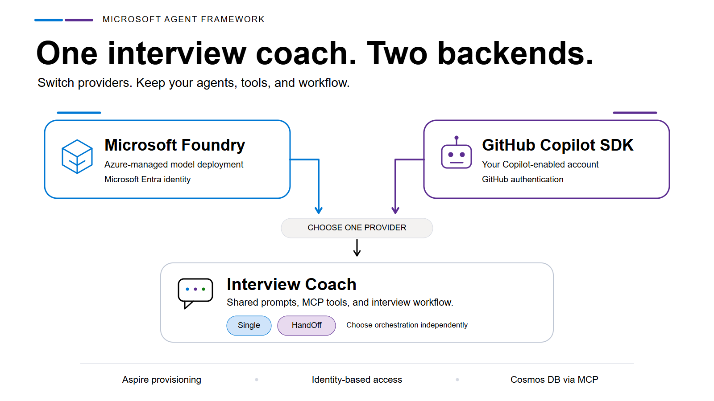

<!--
Draft follow-up to the original Microsoft Developer Blog article.
Repository baseline: 68fd993f39643d7b458bf1798094be953a1020a5.
Covers changes through the documented 3.0.0 release (2026-08-31).
-->

# One interview coach, two backends: Microsoft Foundry and GitHub Copilot SDK

*Switch providers without rewriting your agents, tools, or interview workflow.*

Suppose you've been running the Interview Coach with Microsoft Foundry. A teammate wants to try it using their GitHub Copilot account. How much of the application should they have to change?



*Microsoft Foundry or GitHub Copilot SDK: different backends, shared interview logic.*

In the [updated sample](https://github.com/Azure-Samples/interview-coach-agent-framework), the provider choice looks like this:

```bash
# Run with Microsoft Foundry
aspire start --apphost ./apphost.cs -- --provider MicrosoftFoundry --mode HandOff

# Or run with GitHub Copilot
aspire start --apphost ./apphost.cs -- --provider GitHubCopilot --mode HandOff
```

These are alternative startup configurations, after authenticating with the selected provider as described below. The provider argument changes. The interview workflow does not.

The coach still collects a resume and job description, asks behavioral and technical questions, and produces feedback. You don't need a second set of interview prompts or a Copilot-specific implementation of the tools.

In our [first post](https://developer.microsoft.com/blog/build-a-real-world-example-with-microsoft-agent-framework-microsoft-foundry-mcp-and-aspire/), we explored how Microsoft Agent Framework, MCP, and Aspire fit together in a working interview application. We ended by mentioning integrations we wanted to explore, including GitHub Copilot.

This update follows that thread: can we change what powers the interview coach without changing how we build the interview?

## Why give the same application two backends?

The next developer who clones your repository may not have the same environment you do.

One developer works with Azure and wants to manage a model deployment through Microsoft Foundry, using Azure identity and resource controls. Another already has Copilot access and wants to use it through the GitHub Copilot SDK without provisioning an Azure model deployment.

Both want an interview coach. Neither should need to rewrite its orchestration to match the account they have.

That is the reason for separating provider selection from application behavior. Foundry and Copilot have different setup and authentication paths, but the interview process belongs to the application. Keeping that process shared also avoids maintaining two versions of every specialist prompt and MCP tool assignment.

In our [previous post](https://developer.microsoft.com/blog/build-a-real-world-example-with-microsoft-agent-framework-microsoft-foundry-mcp-and-aspire/), we talked about this Interview Coach app shows the "production-ready" type of demo. Now, we have evolved to provide two different providers - Microsoft Foundry and GitHub Copilot.
Both have different ways to run the same design. The appropriate choice depends on your environment, access requirements, and available models.

It also gives you a useful comparison. Keep the interview scenario and instructions fixed, switch the backend, and observe how the responses and tool use differ. Both providers default to `gpt-5-mini` in the sample, but a shared model name is not a promise of identical behavior. Availability, usage limits, and provider integration still matter.

## What changes underneath the switch?

The shared boundary is Microsoft Agent Framework's `AIAgent`.

The [agent factory](https://github.com/Azure-Samples/interview-coach-agent-framework/blob/main/src/InterviewCoach.Agent/AgentDelegateFactory.cs) creates a `ChatClientAgent` backed by `IChatClient` for Foundry. For GitHub Copilot, it uses `CopilotClient.AsAIAgent()` through the Agent Framework adapter for the Copilot SDK.

Those are different client implementations. Both produce agents the workflow can work with.

The application defines the interview instructions and tools once, then asks the factory to create the appropriate provider-backed agent. The Blazor UI continues to communicate with the agent service through AG-UI. It doesn't need a different chat experience for each provider.

Provider selection is also independent of orchestration. Both Foundry and Copilot support `Single`, where one agent handles the interview, and `HandOff`, where five specialists share the work:

| Agent                  | Responsibility                                        | MCP tools                    |
| ---------------------- | ----------------------------------------------------- | ---------------------------- |
| Triage                 | Routes the conversation to the appropriate phase      | None                         |
| Receptionist           | Sets up the session and collects documents            | MarkItDown and InterviewData |
| Behavioral Interviewer | Asks behavioral questions and records feedback        | InterviewData                |
| Technical Interviewer  | Asks technical questions and records feedback         | InterviewData                |
| Summarizer             | Produces the final feedback and completes the session | InterviewData                |

The normal handoff path runs from the Receptionist through the interviewers to the Summarizer. Specialists can return control to Triage when the user changes direction. Neither the topology nor these tool assignments needs a provider-specific copy.


*The application structure shared by both providers. Cosmos DB access goes through InterviewData MCP (not pictured); the arrows summarize component relationships rather than the full handoff sequence.*

### An easy switch still takes integration work

Handoffs expose an important difference between the adapters.

Agent Framework supplies handoff tools and instructions at run time. In the Copilot adapter version used by this sample, those run options are not consumed directly. Passing only an agent's initial MCP tools would leave out the tools needed to transfer control.

The sample merges the configured tools with the run-time handoff tools, appends the run-time instructions, and creates a lightweight Copilot agent wrapper for that invocation. It also makes handoff tool declarations callable so the workflow can observe the transfer.

That adaptation belongs inside the provider integration. The Receptionist's interview instructions don't need to know about it.

## Choosing Microsoft Foundry: no separate provisioning walkthrough

Supporting two providers is less useful if one of them starts with a long list of resources to assemble manually.

The first post asked you to configure an existing Foundry endpoint and API key. In the updated application, Aspire provisions the Foundry resource and model deployment as part of the application model. There is no separate Foundry provisioning project to run first.

The shared [LLM resource factory](https://github.com/Azure-Samples/interview-coach-agent-framework/blob/68fd993f39643d7b458bf1798094be953a1020a5/src/InterviewCoach.AppHost.Core/LlmResourceFactory.cs) declares Foundry and its model deployment, then connects the agent. In this shortened excerpt, `source` is the agent's Aspire resource builder and the model values come from configuration. SKU, capacity, and environment settings are omitted:

```csharp
var chat = source.ApplicationBuilder
                 .AddFoundry("foundry")
                 .AddDeployment("chat", deploymentName, modelVersion, modelFormat);

return source.WithReference(chat)
             .WaitFor(chat);
```

`WithReference(chat)` supplies the deployment connection information to the agent, while `WaitFor(chat)` makes the agent wait for the deployment to be ready before starting.

Authentication no longer requires copying a Foundry API key into user secrets, either. For local development, sign in with Azure CLI:

```bash
az login
```

Then use the Foundry launch command at the beginning of this post. On the first run, Aspire asks for any missing Azure context and provisions the resource and deployment.

The [agent client](https://github.com/Azure-Samples/interview-coach-agent-framework/blob/68fd993f39643d7b458bf1798094be953a1020a5/src/InterviewCoach.Agent/Program.cs) uses `DefaultAzureCredential` to obtain a Microsoft Entra access token. Locally, it can use your Azure CLI credentials; in Azure, it can use the application's managed identity. The code excludes the managed-identity probe in development.

With optional tenant configuration omitted, the authentication setup looks like this:

```csharp
var credentialOptions = new DefaultAzureCredentialOptions();

BearerTokenPolicy tokenPolicy = new(
    new DefaultAzureCredential(credentialOptions),
    "https://cognitiveservices.azure.com/.default");

ChatClient client = new(
    authenticationPolicy: tokenPolicy,
    ...
);
```

The OpenAI `ChatClient` receives `tokenPolicy` through its `authenticationPolicy` argument, so model requests use bearer tokens rather than a configured API key.

Provisioning and authentication solve different parts of the setup: Aspire creates and connects the dependencies, while identity determines how the application accesses them. Together, they remove the old endpoint-and-key setup from the Foundry path.

You still need an Azure subscription and appropriate permissions. Model availability and quota vary by region, and the Foundry resources incur Azure charges even when the application processes run locally. Aspire handles provisioning; it doesn't remove those requirements.

## Choosing GitHub Copilot: use your existing access

For a developer who already has a Copilot-enabled account, the other path starts with GitHub authentication:

```bash
gh auth login
gh auth status
```

Then select `GitHubCopilot` in the launch command. This local configuration doesn't provision an Azure model deployment. Model requests use the authenticated account's Copilot access, with availability and usage governed by its plan and organization policy.

The SDK package includes the Copilot CLI runtime it needs, so you don't have to install that runtime separately.

Using the SDK doesn't turn the interview coach into a coding assistant. The sample runs it in `CopilotClientMode.Empty` and allowlists the custom tools assigned to each agent, including the handoff tools for that invocation. It does not expose the Copilot CLI's built-in shell, filesystem, or coding tools to the coach.

The same boundaries apply as on the Foundry path: the Receptionist can parse a resume, the interviewers can access interview records, and Triage routes the conversation.

Local sign-in also avoids putting a token in `appsettings.json`, but this is GitHub authentication, not Azure managed identity. Explicit tokens are still supported and take precedence over ambient credentials. For unattended use, the [Copilot setup guide](https://github.com/Azure-Samples/interview-coach-agent-framework/blob/main/docs/providers/GITHUB-COPILOT.md) documents `COPILOT_GITHUB_TOKEN` and the optional `GitHubCopilot:Token` AppHost secret.

The agent reads the optional token when registering its Copilot client:

```csharp
var githubToken = config["COPILOT_GITHUB_TOKEN"];

builder.Services.AddSingleton(_ => new CopilotClient(new CopilotClientOptions
{
    BaseDirectory = Path.Combine(Path.GetTempPath(), "interview-coach-copilot"),
    GitHubToken = githubToken,
    Mode = CopilotClientMode.Empty,
    UseLoggedInUser = string.IsNullOrWhiteSpace(githubToken),
}));
```

When no explicit token is configured, `UseLoggedInUser` allows the SDK to use signed-in credentials. When a token is supplied, the client uses it instead. The AppHost forwards an optional `GitHubCopilot:Token` secret through the same `COPILOT_GITHUB_TOKEN` environment variable.

The provider switch is small because the application handles these differences in one place, not because the providers have identical authentication or execution models.

## The interview record shouldn't depend on the provider

The same separation applies to tools and storage.

Both backends use the InterviewData MCP server to create sessions, retrieve context, append transcripts, and complete interviews. Neither agent implementation accesses the database directly.

Since the first post, that server has moved from SQLite to Azure Cosmos DB for NoSQL through the EF Core Cosmos provider. A session is stored as a document in the `interviewsessions` container, with its ID used as the partition key.

The [AppHost](https://github.com/Azure-Samples/interview-coach-agent-framework/blob/main/apphost.cs) runs the preview Cosmos DB emulator with Data Explorer locally and provisions a managed Cosmos DB account for Azure deployment. This replaces the earlier SQLite-and-Azure-Files persistence arrangement. Docker remains necessary locally for the emulator and MarkItDown, including when you choose Copilot.

The AppHost selects the emulator only in local run mode:

```csharp
var cosmos = builder.AddAzureCosmosDB(ResourceConstants.Cosmos);

if (builder.ExecutionContext.IsRunMode)
{
    cosmos.RunAsPreviewEmulator(emulator => emulator.WithDataExplorer());
}

var cosmosDb = cosmos.AddCosmosDatabase(ResourceConstants.CosmosDatabase);
cosmosDb.AddContainer(ResourceConstants.CosmosContainer, "/id");
```

When publishing, the emulator block is skipped and Aspire provisions Azure Cosmos DB. The database and container definitions stay the same, independently of the selected LLM provider.

The deployed Cosmos DB path uses Microsoft Entra ID; the local emulator uses local key authentication. Aspire provisions the database and container in Azure, rather than having the running service create them through its data client.

For the interviewers, the storage change remains behind MCP. Their job is still to record the interview, whichever provider created the agent.

This persistence covers interview records, not every part of a running session. Uploaded document bytes remain in memory, and Cosmos DB storage does not provide complete workflow checkpoint recovery or live-session transfer between providers.

## Try the choice yourself

You'll need .NET 10, the Aspire CLI, and Docker or an equivalent container runtime. For Foundry, also install Azure CLI and have an Azure subscription. For Copilot, use GitHub CLI and an account with Copilot access.

```bash
git clone https://github.com/Azure-Samples/interview-coach-agent-framework.git
cd interview-coach-agent-framework
```

Authenticate with your selected provider, then run one of the commands at the start of this post. Open the Aspire dashboard from the terminal output, wait for the services to start, and open the `webui` endpoint.

Foundry and `HandOff` are the checked-in defaults. You can change `LlmProvider` and `AgentMode` in `apphost.settings.json`, or override them with command-line arguments.

To compare orchestration without changing the backend, select `Single`:

```bash
aspire start --apphost ./apphost.cs -- --provider GitHubCopilot --mode Single
```

For Azure deployment, install Azure Developer CLI and run:

```bash
azd auth login
azd up
```

The deployment uses the project-based AppHost specified in `azure.yaml`. It shares provider wiring with the file-based AppHost through `InterviewCoach.AppHost.Core`, but has its own configuration file. Set your intended deployment provider and model in `src/InterviewCoach.AppHost/appsettings.json`; changes made only to `apphost.settings.json` do not select the deployment configuration.

A Copilot-backed Azure deployment still needs Cosmos DB and the application infrastructure, plus GitHub authentication available to the hosted service. Selecting Copilot removes the Azure model deployment, not the rest of the application's hosting needs.

Use sample candidate data while exploring. The application exposes DevUI outside development and retains uploads in memory; add appropriate access controls and data-handling policies before using real candidate information.

To delete the resources and stored interview data belonging to your `azd` deployment:

```bash
azd down --force --purge
```

### If you're updating an existing checkout

The current design has two supported provider paths. GitHub Models and standalone Azure OpenAI support have been removed. Copilot uses the Copilot SDK rather than the old GitHub Models connector; the Foundry path still uses OpenAI models and the OpenAI .NET client.

These settings also need attention:

| Earlier configuration                              | Current configuration                                                                |
| -------------------------------------------------- | ------------------------------------------------------------------------------------ |
| `LlmHandOff` or provider-specific `CopilotHandOff` | `HandOff`, supported by both providers                                               |
| `GitHubModels` or `AzureOpenAI` provider           | Choose `MicrosoftFoundry` or `GitHubCopilot`                                         |
| `MicrosoftFoundry:Project` endpoint and API key    | `MicrosoftFoundry` deployment settings, Aspire provisioning, and Azure identity      |
| Copilot token placeholders                         | Remove unused placeholders to use signed-in credentials, or supply a supported token |
| SQLite records and Azure Files storage             | Cosmos DB; migrate any records you need to preserve separately                       |

The repository does not include an automatic SQLite-to-Cosmos migration.

There are maintenance updates behind the shared experience, too. MarkItDown now uses Streamable HTTP through `/mcp` rather than `/sse`. AG-UI hosting uses `AddAGUIServer()` and `MapAGUIServer()`, and build properties and package versions are centralized. The [changelog](https://github.com/Azure-Samples/interview-coach-agent-framework/blob/main/docs/CHANGELOG.md) covers the changes through the documented 3.0.0 release.

## Conclusion: choose the backend, keep the interview

Back to the teammate who wants to use their Copilot account: they can select GitHub Copilot, authenticate, and run the same interview design you use with Microsoft Foundry. They don't need another version of the coach.

The work behind that choice matters more than the command-line flag. Provider-specific code handles agent creation and authentication, leaving the interview instructions, tools, and handoff workflow shared.

### Key takeaways

- **Foundry and Copilot are independent choices from orchestration.** Both support `Single` and `HandOff`; choose the backend that fits your environment without maintaining a second interview implementation.
- **A shared agent interface doesn't erase provider differences.** Microsoft Agent Framework supplies the `AIAgent` boundary, while the Copilot integration adapts run-time handoff tools and instructions. Model behavior and usage limits can still differ.
- **The Foundry path no longer needs separate provisioning or an API key.** Aspire provisions and connects the resource and model deployment; Azure identity supplies access. Copilot uses GitHub authentication, with explicit tokens still available for unattended use.
- **Tools and interview records stay outside the provider integration.** MCP keeps document parsing and Cosmos-backed session storage available to either backend without embedding database access in the agents.

### Try it, compare it, adapt it

1. **Run the sample with your preferred provider.** Clone the [Interview Coach repository](https://github.com/Azure-Samples/interview-coach-agent-framework) and follow the [Foundry](https://github.com/Azure-Samples/interview-coach-agent-framework/blob/main/docs/providers/MICROSOFT-FOUNDRY.md) or [Copilot](https://github.com/Azure-Samples/interview-coach-agent-framework/blob/main/docs/providers/GITHUB-COPILOT.md) setup guide.
2. **Compare one choice at a time.** Start fresh interviews with the same sample resume and job description on each backend, keeping the prompts and agent mode fixed. Compare feedback and tool use, then try `Single` versus `HandOff` with one provider.
3. **Apply the pattern to your own workflow.** Adapt a specialist's instructions or add an MCP tool, then exercise it through both providers. If you find a problem or have an improvement to share, [open an issue](https://github.com/Azure-Samples/interview-coach-agent-framework/issues) or follow the [contribution guide](https://github.com/Azure-Samples/interview-coach-agent-framework/blob/main/docs/CONTRIBUTING.md).

Foundry and Copilot won't necessarily produce the same interview. The useful part is that you can explore those differences without first building another application.

### More readings

- [Microsoft Foundry overview](https://learn.microsoft.com/azure/foundry/what-is-foundry) for the Azure platform behind the Foundry path.
- [GitHub Copilot SDK](https://github.com/github/copilot-sdk) and [SDK authentication](https://docs.github.com/copilot/how-tos/copilot-sdk/auth/authenticate) for the Copilot runtime and credential options.
- [Agent Framework's GitHub Copilot provider](https://learn.microsoft.com/agent-framework/agents/providers/github-copilot) and [handoff orchestration](https://learn.microsoft.com/agent-framework/workflows/orchestrations/handoff) for the agent integration and workflow pattern.
- [Aspire integrations](https://aspire.dev/integrations/overview/) for declaring and connecting application dependencies.
- [DefaultAzureCredential](https://learn.microsoft.com/dotnet/api/azure.identity.defaultazurecredential) for the Azure credential chain.
- [Sample architecture](https://github.com/Azure-Samples/interview-coach-agent-framework/blob/main/docs/ARCHITECTURE.md) and [changelog](https://github.com/Azure-Samples/interview-coach-agent-framework/blob/main/docs/CHANGELOG.md) for implementation details and migration context.
