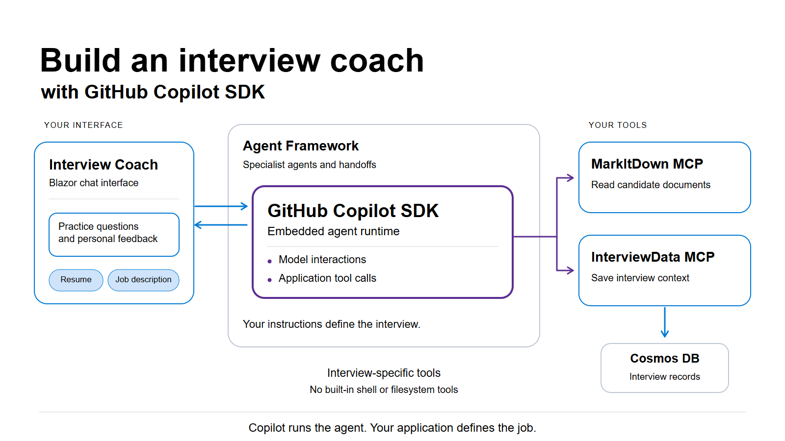

<!--
Draft follow-up to the original Microsoft Developer Blog article.
Repository baseline: 68fd993f39643d7b458bf1798094be953a1020a5.
Covers changes through the documented 3.0.0 release (2026-08-31).
Editorial revision informed by:
https://github.com/Azure-Samples/interview-coach-agent-framework/issues/32
https://gist.github.com/codemillmatt/4973612c495f0301e2ba6c094991ed8c
-->

# Build an interview coach app with the GitHub Copilot SDK

An interview coach has to do more than ask questions. It needs to read a resume, follow up on an incomplete answer, and save enough context to give useful feedback at the end. Some of that work is conversation. Some of it requires calling an application service.

The [GitHub Copilot SDK](https://github.com/github/copilot-sdk) lets you use the runtime behind Copilot CLI for that work inside your own application. You provide instructions and callable tools. Copilot handles the model interaction and resulting tool calls, while your application owns the interface and business workflow.

For a developer building a personal assistant or an internal workflow, this means reusing an agent runtime with capabilities specific to the application. Existing Copilot access is a practical benefit, too: the sample's local Copilot configuration doesn't need a separate Azure model deployment.

[Interview Coach](https://aka.ms/agentframework/interviewcoach) demonstrates this in .NET. The candidate sees a Blazor chat interface. Copilot receives interview instructions and tools for handling documents and session records. We're using Copilot to run part of the app, not to edit its code.



## What the candidate experiences

You provide a resume and job description, answer behavioral and technical questions, and receive feedback on your responses. When you finish, the coach reviews the interview record and produces a summary.

For example, imagine you're applying for a role that involves operating cloud services. An illustrative practice question might be:

> Tell me about a production outage you helped investigate. How did you narrow down the cause, and how did you know the service had recovered?

If your answer focuses only on the fix, the coach could prompt you to explain your own role, the evidence you used, and the result. This is an example of the coaching interaction, not a captured model response.

Behind the chat, the specialists divide that work. They reach the document and record services through Model Context Protocol (MCP), a protocol for connecting agents to external capabilities.

| Agent | Job | MCP tools |
| --- | --- | --- |
| Receptionist | Collect documents and set up the session | MarkItDown and InterviewData |
| Behavioral Interviewer | Ask about experience and give feedback | InterviewData |
| Technical Interviewer | Ask role-specific questions and discuss answers | InterviewData |
| Summarizer | Review the interview record and produce final feedback | InterviewData |
| Triage | Route the initial conversation and handle changes of direction | None |

MarkItDown converts documents into text the agents can use. InterviewData exposes operations for creating, retrieving, and updating interview records.

Following a resume through the application shows how these pieces work together.

## Give Copilot interview tools, not a coding environment

An interview coach should be able to read a resume and save an interview record. It has no reason to run shell commands or edit the application's source files.

The sample's [client configuration](https://github.com/Azure-Samples/interview-coach-agent-framework/blob/main/src/InterviewCoach.Agent/Program.cs) starts Copilot in `CopilotClientMode.Empty`. The agent factory then supplies the instructions and an explicit list of custom tools.

This excerpt from `CreateCopilotSessionConfig` shows that configuration. The full method also sets the model and permission handler:

```csharp
var copilotTools = ToCopilotTools(tools);

return new SessionConfig
{
    AvailableTools = copilotTools
        .Select(tool => $"custom:{tool.Name}")
        .ToList(),
    SystemMessage = new SystemMessageConfig
    {
        Mode = SystemMessageMode.Append,
        Content = instructions,
    },
    Tools = copilotTools,
};
```

`Tools` supplies the custom definitions and callable handlers. `AvailableTools` identifies which tools the agent may use. The `custom:` prefix selects those supplied tools rather than Copilot CLI's built-in tools.

When a candidate supplies a resume link, the Receptionist can use MarkItDown to convert the document. It then has InterviewData save the relevant context to the session record. That tool writes to Cosmos DB and returns a result the runtime can use in its next response. The agent doesn't need a database client or built-in filesystem tools to perform these operations.

Tool selection controls exposure, but it is not a complete security boundary. The sample's permission handler approves tool permission requests. A deployed application still needs authorization checks and an appropriate policy for the actions its tools can perform.

## Connect Copilot to the interview workflow

The application uses Microsoft Agent Framework to connect the interview specialists. It represents each one as an `AIAgent`, which the workflow can invoke and hand control to.

The Copilot adapter connects the SDK runtime to that abstraction.

The [agent factory](https://github.com/Azure-Samples/interview-coach-agent-framework/blob/main/src/InterviewCoach.Agent/AgentDelegateFactory.cs) creates a Copilot-backed specialist like this:

```csharp
private static AIAgent CreateCopilotRunAgent(
    CopilotClient client,
    string name,
    string description,
    string? model,
    string instructions,
    IList<AITool>? tools)
{
    return client.AsAIAgent(
        CreateCopilotSessionConfig(model, instructions, tools),
        ownsClient: false,
        name: name,
        description: description);
}
```

`AsAIAgent()` lets the workflow use Copilot through the interface it already understands. `ownsClient: false` keeps the wrapper from taking ownership of the shared Copilot client, whose lifetime is managed by the application.

The responsibilities remain distinct. Copilot handles model interactions and tool execution for a specialist. Agent Framework connects the specialists and manages their handoffs. Application instructions describe the interview itself.

For example, the Behavioral Interviewer is instructed to use the STAR method: Situation, Task, Action, Result. It asks questions one at a time, gives feedback, and records the exchange. You can revise that coaching behavior without changing how the application communicates with Copilot.

This integration builds on the [original Foundry-powered application](https://developer.microsoft.com/blog/build-a-real-world-example-with-microsoft-agent-framework-microsoft-foundry-mcp-and-aspire/). Agent Framework, specialist prompts, and MCP tools were already there. Adding Copilot did not require a second UI or another set of interview instructions: its adapter participates through the same `AIAgent` interface. Foundry remains supported. That reuse is a consequence of the design, rather than a new orchestration capability introduced by Copilot.

## Include the tools that let specialists hand off

An agent needs tools for transferring control as well as tools for its interview work.

After collecting the documents, the Receptionist normally transfers the conversation to the Behavioral Interviewer. The Technical Interviewer and Summarizer follow. Triage is available when the candidate asks to change direction.

Agent Framework expresses those connections in the handoff builder:

```csharp
var workflow = AgentWorkflowBuilder
    .CreateHandoffBuilderWith(triageAgent)
    .WithHandoffs(triageAgent, [receptionistAgent, behaviouralAgent, technicalAgent, summariserAgent])
    .WithHandoffs(receptionistAgent, [behaviouralAgent, triageAgent])
    .WithHandoffs(behaviouralAgent, [technicalAgent, triageAgent])
    .WithHandoffs(technicalAgent, [summariserAgent, triageAgent])
    .WithHandoff(summariserAgent, triageAgent)
    .Build();
```

The framework supplies transfer tools and additional instructions when it invokes an agent. The [sample implementation at commit `68fd993`](https://github.com/Azure-Samples/interview-coach-agent-framework/blob/main/src/InterviewCoach.Agent/AgentDelegateFactory.cs) includes an adapter workaround because those run-time options were not automatically applied on the Copilot path. The repository uses floating package versions, so this describes the linked implementation rather than a limitation of every Copilot SDK release.

Supplying only the initial MCP tools leaves out the functions needed to hand off. The sample merges both sets before creating the Copilot agent for that invocation:

```csharp
internal static IList<AITool> MergeCopilotTools(
    IList<AITool>? configuredTools,
    AgentRunOptions? options)
{
    var runTools = (options as ChatClientAgentRunOptions)?.ChatOptions?.Tools;

    return (configuredTools ?? [])
        .Concat(runTools ?? [])
        .DistinctBy(tool => tool.Name, StringComparer.Ordinal)
        .ToList();
}
```

The configured tools perform the interview work. The run-time tools allow transfers between specialists. Deduplicating by name avoids supplying the same tool twice.

`MergeCopilotInstructions` appends the run-time instructions to the specialist's prompt. The integration also wraps handoff tool definitions as functions the SDK can call. It creates a lightweight agent wrapper for each invocation while reusing the Copilot client. This handling applies to both regular and streaming responses.

When integrating a runtime with an orchestration framework, check what the framework supplies at invocation time. Static tools alone may serve a single agent, but this interview also needs the tools that control its progression.

## Running the sample

Local authentication can use the developer's signed-in GitHub credentials. If you configure a token, the application uses it instead of relying on an existing sign-in. The .NET SDK bundles the Copilot CLI runtime it needs, and this configuration does not provision a Foundry model deployment.

The other services still need to run. Aspire starts the application components; containers run MarkItDown and the local Cosmos DB emulator. InterviewData now uses Cosmos DB rather than the earlier SQLite store, but the agents continue to access records through MCP.

For developers retaining the Foundry configuration, Aspire now provisions the resource and model deployment without a separate provisioning step. Azure access uses `DefaultAzureCredential` rather than a Foundry API key. The [provider guides](https://github.com/Azure-Samples/interview-coach-agent-framework/blob/main/docs/providers/README.md) cover that path as well as Copilot authentication, deployment, and configuration.

SDK requests count against the authenticated account's Copilot usage. Available models and access depend on the plan and organization policy. Existing access does not mean unlimited or automatically free requests, and it does not supply an authentication design for a public application with many users.

Use sample candidate data. Although Cosmos DB stores interview records, uploaded document bytes remain in memory, and the sample does not implement complete workflow recovery. It also exposes DevUI outside development. Before handling real resumes, restrict access to the application and developer tools, review tool permissions, and establish data-retention policies.

## Put Copilot to work in your own app

Interview Coach gives Copilot a job outside the editor: work with a candidate's documents and answers, call the application's tools, and help produce interview feedback. The SDK supplies the model and tool-call loop. Agent Framework connects the specialists, and the application defines the coaching behavior.

Try the application using the [Copilot setup guide](https://github.com/Azure-Samples/interview-coach-agent-framework/blob/main/docs/providers/GITHUB-COPILOT.md). After an interview with sample data, change the feedback instructions for one specialist or connect a tool for your own workflow. You can experiment with the experience you want to build while Copilot handles the runtime interactions underneath it.

### Further reading

- [GitHub Copilot SDK architecture](https://github.com/github/copilot-sdk#architecture) and [authentication](https://docs.github.com/copilot/how-tos/copilot-sdk/auth/authenticate).
- [Agent Framework's Copilot provider](https://learn.microsoft.com/agent-framework/agents/providers/github-copilot) and [handoff orchestration](https://learn.microsoft.com/agent-framework/workflows/orchestrations/handoff).
- [Sample source](https://github.com/Azure-Samples/interview-coach-agent-framework) and [architecture](https://github.com/Azure-Samples/interview-coach-agent-framework/blob/main/docs/ARCHITECTURE.md).
- [Original Foundry walkthrough](https://developer.microsoft.com/blog/build-a-real-world-example-with-microsoft-agent-framework-microsoft-foundry-mcp-and-aspire/) and [sample changelog](https://github.com/Azure-Samples/interview-coach-agent-framework/blob/main/docs/CHANGELOG.md).
