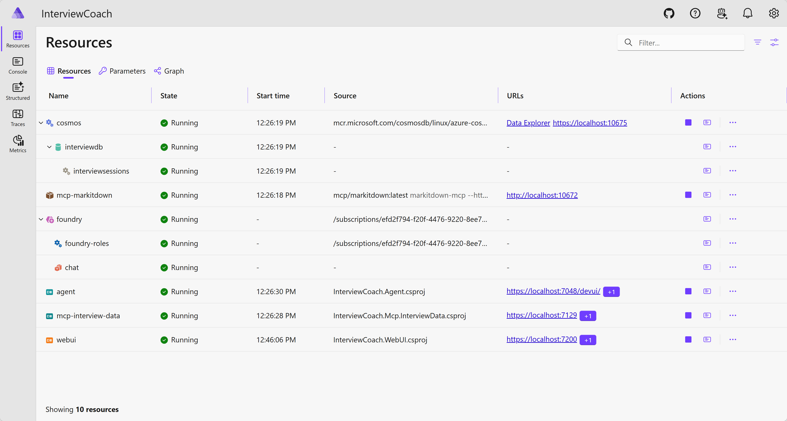
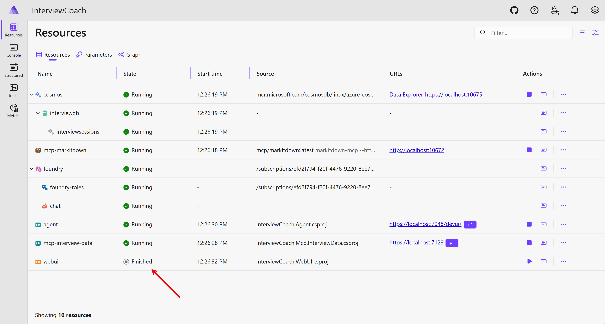
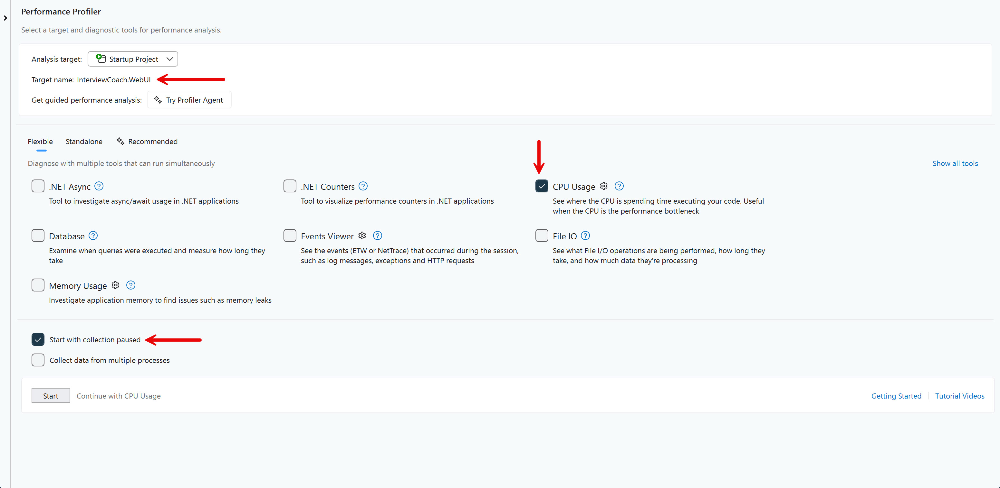
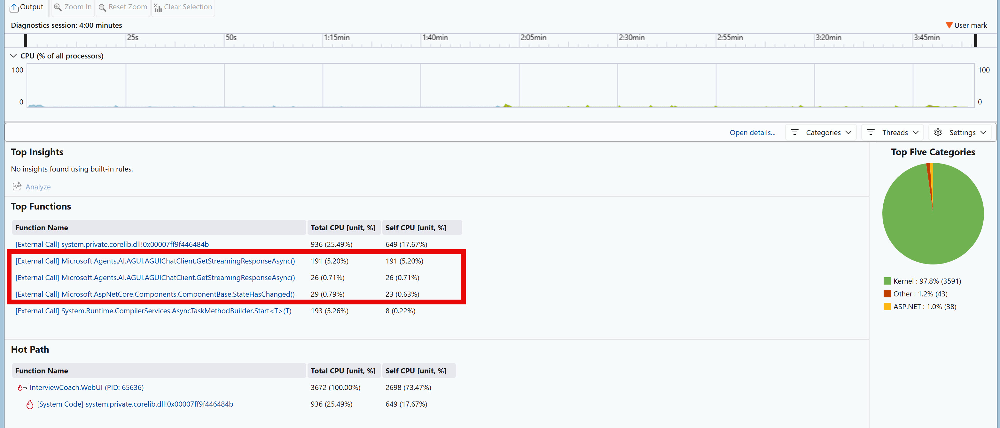
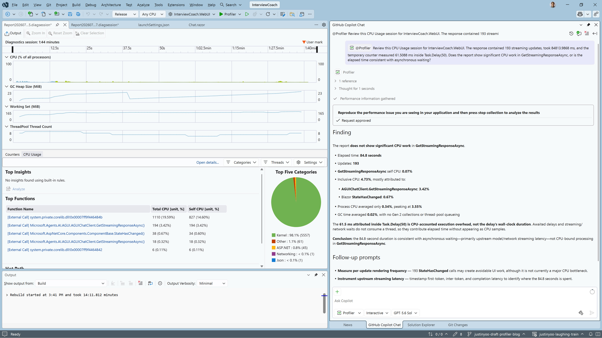

# The hidden 50 ms cost of every AI streaming update

Streaming is supposed to make an AI application feel fast. The first part of an answer appears while the model is still producing the rest, so the user can start reading before the response is complete.

But an application can add its own latency after the model starts responding. That is what the [Interview Coach](https://aka.ms/agentframework/interviewcoach) sample app does.

## Why the first response felt slow

The Interview Coach Web UI sends a prompt to a backend agent and renders the agent's response as a stream of updates. I tested it with this prompt:

```text
Hi, I'm Peter. Here's my resume: https://justinyoo.github.io/fake-resumes/resume-peter-parker.pdf. And this is JD: https://justinyoo.github.io/fake-resumes/jd-cloud-solution-architect.pdf
```

The first complete response took roughly 1.5 to 2 minutes. Some of that time was expected: the first turn parses the PDF into Markdown and stores initial data in Cosmos DB. Even with that work in mind, the response felt slower than expected.

I wanted to know where the time was going. Was the machine busy with CPU-intensive agent work? Was the delay in the network or model? Or was the Web UI slowing down the stream after it arrived?

Visual Studio's [Performance Profiler](https://learn.microsoft.com/visualstudio/profiling/what-is-a-profiler) was a good place to start.

## What I needed to measure

The task was to profile the process that owns the streaming code and answer two questions:

1. Was `InterviewCoach.WebUI` CPU-bound while it processed the response?
2. Did the Web UI add measurable waiting time to every streaming update?

Interview Coach runs as an Aspire distributed application. AppHost starts the Web UI, agent, MCP servers, and data services as separate processes. A profile of AppHost does not automatically describe the Blazor code running in `InterviewCoach.WebUI`.

CPU Usage can collect data from multiple Aspire processes, but this investigation needed an unambiguous Web UI target. I therefore kept the backend resources under Aspire and launched the Web UI separately from Visual Studio.

## Set up a trustworthy profiling run

### Run the backend resources under Aspire

This walkthrough assumes the sample is configured for [local Azure provisioning](https://aspire.dev/integrations/cloud/azure/local-provisioning/).

From the repository root, start AppHost:

```powershell
aspire start --apphost .\src\InterviewCoach.AppHost\InterviewCoach.AppHost.csproj
```

Wait until the `agent` and `webui` resources are running in the Aspire dashboard.



For this run, the agent used port 7048 and the Web UI used port 7200. Verify the endpoints before continuing:

```powershell
Invoke-WebRequest https://localhost:7048/health
Invoke-WebRequest https://localhost:7200/health
```

Both requests should return HTTP 200. Aspire can assign different ports after a restart, so use the endpoints shown in your dashboard rather than assuming these values will stay fixed.

Stop only the Aspire-managed Web UI:

```powershell
aspire resource webui stop
```

The agent and its dependencies remain under Aspire.



Stopping the resource does not release port 7200. Aspire's DCP proxy continues to reserve the original endpoint, so the standalone Web UI needs different ports.

### Configure a standalone Web UI profile

Add a `Profiler` profile under `profiles` in `src/InterviewCoach.WebUI/Properties/launchSettings.json`:

```json
"Profiler": {
  "commandName": "Project",
  "dotnetRunMessages": true,
  "launchBrowser": true,
  "applicationUrl": "https://localhost:7201;http://localhost:5088",
  "environmentVariables": {
    "ASPNETCORE_ENVIRONMENT": "Development",
    "Services__agent__https__0": "localhost:7048"
  }
}
```

The Web UI addresses the agent through a logical service name:

```csharp
client.BaseAddress = new Uri("https+http://agent");
```

The environment variable maps to the .NET configuration path `Services:agent:https:0`. The configuration-based service discovery provider turns `localhost:7048` into an HTTPS endpoint for the logical `agent` service. The value therefore contains the host and port, not the `https://` prefix.

If Aspire assigns a different agent port, update the profile before starting Visual Studio. Do not commit a machine-specific dynamic port.

In Visual Studio:

1. Set `InterviewCoach.WebUI` as the startup project.
2. Select the `Profiler` launch profile.
3. Set the build configuration to `Release`.
4. Open **Debug > Performance Profiler**, or press **Alt+F2**.
5. Confirm that the target is `InterviewCoach.WebUI`.
6. Select **CPU Usage**.
7. Select **Start with collection paused**.



Start the application. When the Web UI is ready, resume profiler collection, submit the test prompt, and stop collection when the response finishes.



The CPU report did not show an application hot path that explained the long elapsed time. That suggested the Web UI was not CPU-bound during the capture, but it did not identify the cause. CPU Usage records active CPU work; asynchronous waiting does not appear as a large CPU hot path.

### Inspect the streaming loop

The response loop in `src/InterviewCoach.WebUI/Components/Pages/Chat/Chat.razor` contained a useful clue:

```csharp
await foreach (var update in ChatClient.GetStreamingResponseAsync(
    outboundMessages,
    chatOptions,
    cancellationToken))
{
    await Task.Delay(50);

    messages.AddMessages(update, filter: c => c is not TextContent);

    if (update.Role == ChatRole.Assistant)
    {
        responseText.Text += update.Text;
        ChatMessageItem.NotifyChanged(responseMessage);
    }

    StateHasChanged();
}
```

This line pauses every streaming update:

```csharp
await Task.Delay(50);
```

If a response arrives in 200 updates, the nominal accumulated delay is 10 seconds:

```text
200 updates x 50 ms = 10,000 ms
```

The delay appears to pace updates before the UI refreshes. Regardless of why it was added, its cost grows linearly with the number of updates.

### Measure the accumulated wait

CPU Usage cannot measure elapsed time spent awaiting `Task.Delay`. To capture that value, add `@using System.Diagnostics` to `Chat.razor` and place temporary counters around the existing loop:

```csharp
var responseTimer = Stopwatch.StartNew();
var measuredDelay = TimeSpan.Zero;
var updateCount = 0;

await foreach (var update in ChatClient.GetStreamingResponseAsync(
    outboundMessages,
    chatOptions,
    cancellationToken))
{
    updateCount++;

    var delayStarted = Stopwatch.GetTimestamp();
    await Task.Delay(50);
    measuredDelay += Stopwatch.GetElapsedTime(delayStarted);

    // Existing update handling...
}

Logger.LogInformation(
    "Stream completed in {ElapsedMs} ms across {UpdateCount} updates; "
    + "artificial delay consumed {DelayMs} ms",
    responseTimer.Elapsed.TotalMilliseconds,
    updateCount,
    measuredDelay.TotalMilliseconds);
```

The code logs once after the response completes:

```text
Stream completed in {{ total elapsed time }} ms across {{ number of streaming updates }} updates; artificial delay consumed {{ measured delay time }} ms
```

These are streaming updates, not model tokens. One response update does not necessarily represent one token.

`Task.Delay(50)` guarantees a minimum wait, not an exact resumption time. Thread scheduling and other work can make the measured interval longer than 50 ms.

I ran the same prompt five times.

### Remove the delay and repeat

For comparison, I removed `await Task.Delay(50)` and ran the same prompt five more times. I left the timestamp calls in place temporarily so both versions produced the same log format. Without the awaited delay between them, those calls measure only instrumentation overhead.

The live model can produce a different response and update count on every run. Total response time therefore includes model and network variation. It is useful user-experience context, but the delay counter is the measurement that isolates the Web UI's artificial wait.

### Ask Profiler Agent for a second reading

Visual Studio 2026 includes [GitHub Copilot Profiler Agent](https://learn.microsoft.com/visualstudio/profiling/profile-with-copilot-agent). I used it to review the CPU session together with the counter values.

```text
@Profiler Review this CPU Usage session for InterviewCoach.WebUI. The response contained 193 streaming updates, took 84,813.9868 ms, and accumulated approximately 11,871 ms inside Task.Delay(50), or 61.5088 ms per update. Does the report show significant CPU work in GetStreamingResponseAsync, or is the elapsed time consistent with asynchronous waiting?
```

The question is deliberately narrow. Profiler Agent can help interpret the report, but the CPU profile still cannot measure the elapsed wait by itself.



Profiler Agent reached the same supporting interpretation: response processing was not CPU-bound. The direct timer remained the evidence for the accumulated delay.

## What the measurements showed

### Baseline with `Task.Delay(50)`

| Run | Total elapsed (ms) | Update count | Expected delay (ms) | Measured delay (ms) | Delay/update (ms) |
|----:|-------------------:|-------------:|--------------------:|--------------------:|------------------:|
| 1   | 92386.3482         | 168          | 8400                | 10299.8094          | 61.3084           |
| 2   | 84772.6630         | 188          | 9400                | 11549.6042          | 61.4341           |
| 3   | 90705.5531         | 153          | 7650                | 9376.8390           | 61.2865           |
| 4   | 79027.4327         | 147          | 7350                | 9028.3215           | 61.4172           |
| 5   | 69061.6113         | 190          | 9500                | 11714.1005          | 61.6532           |
| AVG | 83190.7217         | 169          | 8460                | 10393.7349          | 61.4199           |
| MED | 84772.6630         | 168          | 8400                | 10299.8094          | 61.4172           |

The five runs recorded between 9.03 and 11.71 seconds inside the artificial delay. The median accumulated delay was 10.30 seconds.

The measured interval averaged 61.42 ms per update, about 11 ms longer than the nominal 50 ms. The accumulated wait, rather than the difference between 50 ms and 61 ms, is the performance issue.

### After removing `Task.Delay(50)`

| Run | Total elapsed (ms) | Update count | Measured timer overhead (ms) | Overhead/update (ms) |
|----:|-------------------:|-------------:|-----------------------------:|---------------------:|
| 1   | 98450.7463         | 226          | 0.0262                       | 0.0001               |
| 2   | 69886.9730         | 174          | 0.0155                       | 0.0001               |
| 3   | 77264.4819         | 289          | 0.0256                       | 0.0001               |
| 4   | 58254.1312         | 163          | 0.0171                       | 0.0001               |
| 5   | 86431.5633         | 164          | 0.0257                       | 0.0002               |
| AVG | 78057.5791         | 203          | 0.0220                       | 0.0001               |
| MED | 77264.4819         | 174          | 0.0256                       | 0.0001               |

The tiny measured intervals in this table are timestamp overhead. They do not represent the model, network, rendering, or end-to-end processing time for each update.

The median total response fell from 84.77 seconds to 77.26 seconds, a difference of about 7.51 seconds. That comparison is not a controlled benchmark because the live model produced different responses and update counts. The direct result is simpler: removing the line removed the 9 to 12 seconds of application-added waiting measured in the baseline runs.

## Remove the wait, not the stream

The profiler investigation worked only after it targeted the process that owned the code. AppHost was useful for orchestrating the agent and its dependencies, while the standalone Web UI gave Visual Studio an unambiguous profiling target.

CPU Usage then answered one part of the question: the captured response was not dominated by application CPU work. It could not expose the accumulated asynchronous wait, so a direct timer around `Task.Delay(50)` supplied the missing evidence.

The measurements do not support keeping an unconditional 50 ms delay on every update. The response still streams after the delay is removed. If the UI needs deliberate pacing, that behavior should be designed and measured separately rather than tying latency to the number of incoming updates.

One option is to consume updates immediately but coalesce UI refreshes. This example renders at most once every 50 ms and always flushes the final update:

```csharp
// Limit UI refreshes to at most once every 50 ms without delaying stream consumption.
var renderInterval = TimeSpan.FromMilliseconds(50);
var lastRenderAt = Stopwatch.GetTimestamp();
var renderPending = false;
var textChanged = false;

try
{
    await foreach (var update in ChatClient.GetStreamingResponseAsync(
        outboundMessages,
        chatOptions,
        cancellationToken))
    {
        messages.AddMessages(update, filter: c => c is not TextContent);
        renderPending = true;

        if (update.Role == ChatRole.Assistant &&
            !string.IsNullOrEmpty(update.Text))
        {
            responseText.Text += update.Text;
            textChanged = true;
        }

        // Flush pending UI changes once the render interval has elapsed.
        if (Stopwatch.GetElapsedTime(lastRenderAt) < renderInterval)
        {
            continue;
        }

        FlushRender();
        lastRenderAt = Stopwatch.GetTimestamp();
    }
}
finally
{
    FlushRender();
}

void FlushRender()
{
    if (!renderPending)
    {
        return;
    }

    if (textChanged)
    {
        ChatMessageItem.NotifyChanged(responseMessage);
    }

    StateHasChanged();
    renderPending = false;
    textChanged = false;
}
```

Unlike `Task.Delay(50)`, this does not pause each incoming update. Bursts are combined into fewer renders, while slower updates still appear as they arrive. The 50 ms refresh interval is a starting point, not a fixed recommendation; profile it with the expected stream rate and adjust it based on responsiveness and render cost. This coalesced version was not part of the measurements above, so it needs its own before-and-after run.

Fifty milliseconds looked cheap in isolation. Repeated across a real response, it became roughly 10 seconds of avoidable waiting.

## References

- [Service discovery in .NET](https://learn.microsoft.com/dotnet/core/extensions/service-discovery)
- [Analyze performance by using CPU profiling](https://learn.microsoft.com/visualstudio/profiling/cpu-usage)
- [Profile your app with GitHub Copilot Profiler Agent](https://learn.microsoft.com/visualstudio/profiling/profile-with-copilot-agent)
