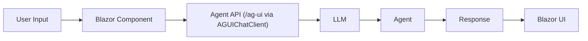
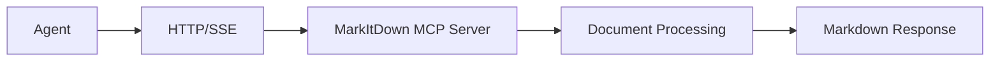
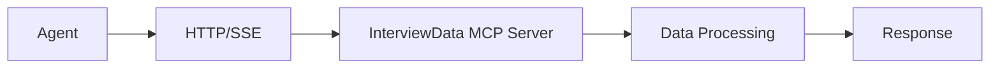
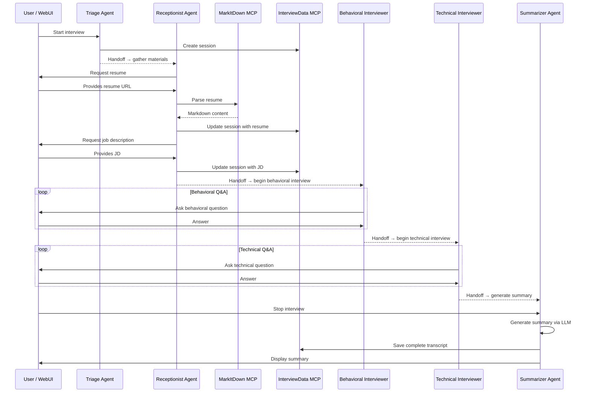

# Architecture Overview

This document provides a deep dive into the Interview Coach application architecture, explaining how components work together to create a production-ready AI agent system.

## System Architecture

The application follows a **microservices architecture** orchestrated by [Aspire](https://aspire.dev), with clear separation between the AI agent, user interface, extensibility layer (MCP servers), and data persistence.

### Key Architectural Decisions

1. **MCP-Based Extensibility**: Tools are implemented as separate MCP servers rather than direct integrations, enabling reusability and independent development
2. **Provider Abstraction**: LLM provider is configurable at runtime, supporting Foundry, Azure OpenAI, and GitHub Models
3. **Aspire Orchestration**: Service discovery, health checks, and observability are built-in through .NET Aspire
4. **Stateful Sessions**: Interview sessions persist to SQLite, allowing resume/pause functionality

## Component Deep Dive

### 1. InterviewCoach.Agent (AI Agent Service)

**Purpose**: The core AI agent that conducts interviews, manages conversation flow, and orchestrates tool usage.

**Technology Stack**:

- ASP.NET Core Web API
- Microsoft Agent Framework
- OpenAI SDK for chat completions
- MCP client for tool integration
- AG-UI intergation for communication with web UI

**Agent Capabilities**

- Mode selection: Single agent, Muilti-agent Handoff (Microsoft Foundry or GitHub Copilot)
- Instructions: Step-by-step interview process (per-agent in handoff modes)
- Tools: MarkItDown (document parsing) + InterviewData (session management)
- Chat client: Provider-agnostic `IChatClient` interface

### 2. InterviewCoach.WebUI (User Interface)

**Purpose**: Blazor-based web application providing the user interface for interacting with the interview coach agent.

**Technology Stack**:

- Blazor Web App
- Tailwind CSS for styling
- Marked.js for markdown rendering
- DOMPurify for XSS protection
- AG-UI integration for communication with the backend agent service

**Communication Flow**:

### 3. InterviewCoach.Mcp.MarkItDown (Document Parsing MCP Server)

**Purpose**: External MCP server that converts various document formats (PDF, DOCX, etc.) to markdown for agent consumption.

**Source**: [Microsoft MarkItDown](https://github.com/microsoft/markitdown)

**Why External?**:

- Language-agnostic (Python-based)
- Reusable across projects
- Independently maintained by Microsoft
- Demonstrates external MCP integration

**Integration Pattern**:

### 4. InterviewCoach.Mcp.InterviewData (Custom MCP Server)

**Purpose**: Custom .NET MCP server managing interview session state and persistence.

**Technology Stack**:

- ASP.NET Core Web API
- Model Context Protocol SDK
- Entity Framework Core with SQLite

**Integration Pattern**:

### 5. InterviewCoach.AppHost (Aspire Orchestration)

**Purpose**: .NET Aspire application model defining service topology, dependencies, and configuration.

### 6. InterviewCoach.ServiceDefaults (Shared Configuration)

**Purpose**: Common service configuration shared across all projects (observability, health checks, service discovery).

## Multi-Agent Handoff Workflow

## Next Steps

- **[Learning Objectives](LEARNING-OBJECTIVES.md)**: Understand what you'll learn
- **[Tutorials](TUTORIALS.md)**: Hands-on learning exercises
- **[FAQ](FAQ.md)**: Common questions answered
